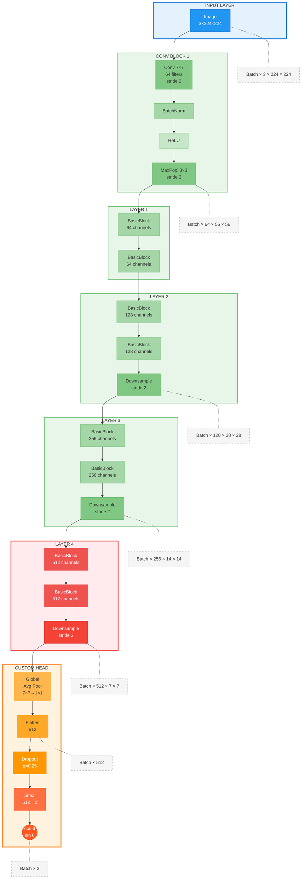

# Rotation Detection Neural Network

A deep learning system that accurately predicts the rotation angle of images using a modified ResNet18 architecture with trigonometric output representation.

## Architecture Overview



## Key Features

- **Rotation Range**: Full 0-360° angle detection
- **Output Representation**: Trigonometric (cos, sin) for continuous circular values
- **Architecture**: Modified ResNet18 with selective layer unfreezing
- **Performance**: ~13.8° Mean Absolute Error
- **Training Time**: ~15-20 minutes on RTX 5080 GPU for 1000 initial samples
- **Robustness**: Early stopping, gradient clipping, and learning rate scheduling

## Requirements

```bash
# Core dependencies
torch>=2.0.0
torchvision>=0.15.0
fiftyone>=0.22.0
opencv-python>=4.8.0
numpy>=1.24.0
matplotlib>=3.7.0
Pillow>=10.0.0
```

## Installation

```bash
# Clone the repository
git clone https://github.com/yourusername/rotation-detection-nn.git
cd rotation-detection-nn

# Install dependencies
pip install -r requirements.txt
```

## Dataset Preparation

```bash
# Prepare the rotated dataset
python prepare_data.py

# Configuration options in prepare_data.py:
# - SOURCE_MAX_SAMPLES: 20000 (number of original images)
# - NUM_ROTATIONS_PER_IMAGE: 6 (augmentation factor)
# - PADDING_STRATEGY: 'reflect' (options: crop, reflect, random_bg, alpha_mask)
# - ANGLE_RANGE: (0, 360) (full rotation range)
```

## Training

```bash
# Train the model
python train_model.py

# Key configuration in train_model.py:
# - BATCH_SIZE: 1024
# - NUM_EPOCHS: 50 (with early stopping)
# - LEARNING_RATE: 0.001
# - UNFROZEN_LAYERS: ("layer4", "fc")
```

## Model Details

### Architecture Modifications

1. **Backbone**: ResNet18 pretrained on ImageNet
2. **Frozen Layers**: All layers except layer4 and fc
3. **Custom Head**: 
   - Dropout (p=0.25)
   - Linear: 512 → 2 (cos, sin output)

### Loss Function

- **Type**: Mean Squared Error (MSE)
- **Target**: [cos(θ), sin(θ)] representation
- **Advantages**: 
  - Continuous representation (no discontinuity at 0°/360°)
  - Equal weight to all angles
  - Smooth gradients

### Training Strategy

1. **Optimizer**: Adam (lr=0.001, weight_decay=1e-4)
2. **LR Schedule**: StepLR (÷10 every 12 epochs)
3. **Gradient Clipping**: max_norm=1.0
4. **Early Stopping**: patience=5, min_delta=0.01°
5. **Batch Size**: 1024 (dynamically adjusted for GPU memory)

## Results

### Performance Metrics

| Metric | Value |
|--------|-------|
| Best Validation MAE | 13.82° |
| Training Time | 22 minutes |
| Model Parameters | 8.4M (trainable) |
| Total Parameters | 11.2M |

### Error Distribution

- **50th percentile**: ~10° error
- **90th percentile**: ~25° error
- **95th percentile**: ~35° error
- **Samples within ±15°**: ~65%

## Visualizations

The training script generates comprehensive visualizations:

1. **Training History**: Loss curves, MAE progression, learning rate schedule
2. **Error Analysis**: Distribution plots, scatter plots, percentile analysis
3. **Grad-CAM**: Attention heatmaps showing model focus areas
4. **Statistics**: Detailed error metrics and performance breakdowns

## Use Cases

- **Image Orientation Correction**: Automatically detect and correct image rotation
- **Quality Control**: Verify correct orientation in image processing pipelines
- **Data Augmentation**: Generate accurately labeled rotated datasets
- **Computer Vision Research**: Baseline for rotation-invariant algorithms

## Contributing

Contributions are welcome! Please feel free to submit a Pull Request.

## License

This project is licensed under the MIT License - see the LICENSE file for details.

## Acknowledgments

- COCO dataset for providing diverse training images
- PyTorch and torchvision teams for the pretrained models
- FiftyOne for excellent dataset management tools