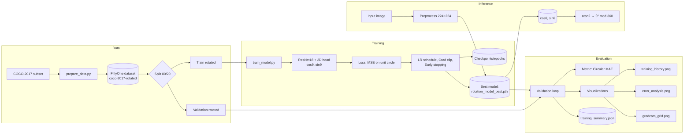

# Image Rotation Regression on COCO-2017

A compact, production-minded pipeline for estimating the absolute rotation of natural images over the full range from 0 to 360 degrees. The model is a ResNet18 backbone with a trigonometric two-dimensional head that predicts the pair \((\cos\theta, \sin\theta)\). Trained on a large, synthetically rotated subset of COCO-2017, it reaches a validation mean absolute error of approximately \(4.57^\circ\) with strong coverage across angle ranges. The repository includes reproducible data generation, training, evaluation, and interpretability visualizations.

---

## Why predict \((\cos\theta, \sin\theta)\) instead of \(\theta\) directly

Angles are circular. Regressing a scalar in degrees introduces a discontinuity at 0 and 360. This project predicts a point on the unit circle and reconstructs the angle by
\[
\hat{\theta} \;=\; \operatorname{atan2}(\hat{s}, \hat{c}) \times \frac{180}{\pi} \bmod 360,
\]
where \(\hat{c}\) and \(\hat{s}\) are the network outputs for \(\cos\theta\) and \(\sin\theta\). Training minimizes mean squared error between target and prediction in this two-dimensional space,
\[
\mathcal{L} \;=\; \lVert\,\mathbf{y} - \hat{\mathbf{y}}\,\rVert_2^2,\quad \mathbf{y}=[\cos\theta,\sin\theta].
\]
Evaluation uses a circular absolute error,
\[
\operatorname{CAE}(\hat{\theta},\theta) \;=\; \min\left(\lvert \hat{\theta}-\theta\rvert,\; 360 - \lvert \hat{\theta}-\theta\rvert\right).
\]

---

## Highlights

- Full 0 to 360 degree orientation estimation using a lightweight ResNet18 head.
- Trained on 30k COCO images with 6 random rotations each, uniform over \([0, 360)\); final dataset size about 210k samples.
- Validation mean absolute error \(\approx 4.57^\circ\); median absolute error \(\approx 1.74^\circ\).
- Robust training loop with early stopping, gradient clipping, and a stepped learning-rate schedule.
- Comprehensive diagnostics: training curves, error analysis, and Grad-CAM attention maps.

---


## Repository structure

```
.
├── prepare_data.py            # COCO subset loader and synthetic rotation generator
├── train_model.py             # Training, evaluation, visualizations, checkpoints
├── visualizations/            # Generated figures and a JSON training summary
│   ├── training_history.png
│   ├── error_analysis.png
│   ├── gradcam_grid.png
│   └── training_summary.json
├── checkpoints/               # Periodic checkpoints during training
└── rotation_model_best.pth    # Best-scoring model (created after training)
```

---

## Data pipeline

This project builds a synthetic rotation dataset on top of COCO-2017 using FiftyOne.

- Source split: a 30k-image subset of COCO-2017 train.
- Rotations per image: 6 random angles sampled uniformly in \([0, 360)\).
- Border handling: **reflect** padding by default. Other strategies exist in the code for experimentation: crop, random background, or alpha mask.
- Output: a persistent FiftyOne dataset named `coco-2017-rotated`. Rotated images are stored on disk and tagged as `rotated` for filtering and splitting.

Run:
```bash
python prepare_data.py
```

The final dataset contains roughly 209,958 samples in total, of which 179,958 are rotated. Training uses only the rotated samples and performs an 80 to 20 split into train and validation.

---

## Model

- **Backbone**: `torchvision.models.resnet18` pretrained on ImageNet.
- **Trainable layers**: only `layer4` and the new head are unfrozen, for a total of about 8.4M trainable parameters.
- **Head**: `Dropout(p=0.25)` followed by a `Linear(512 → 2)` layer that emits \((\cos\theta, \sin\theta)\).
- **Transforms**: standard ImageNet normalization, with light spatial and photometric augmentation on the training side
  - `RandomResizedCrop(224, scale=(0.85, 1.0))`
  - `ColorJitter` with small brightness, contrast, and saturation jitter
  - Validation uses deterministic resize to \(224\times224\)

---

## Training and evaluation

- **Optimizer**: Adam with learning rate \(1\times 10^{-3}\) and weight decay \(1\times 10^{-4}\).
- **Schedule**: `StepLR` drops the learning rate by \(10\times\) at epochs 12, 24, and 36.
- **Batch size**: target 1024 with on-device probing to back off if memory is limited.
- **Regularization**: gradient clipping with max norm \(1.0\) and dropout in the head.
- **Early stopping**: patience 5 epochs on validation MAE with a minimum improvement threshold of 0.01.
- **Metric**: circular mean absolute error (CAE) in degrees, defined above.

Start training:
```bash
python train_model.py
```

Artifacts are written to `visualizations/` and `checkpoints/`. The best model is saved as `rotation_model_best.pth`.

---

## Results

**Training summary.** On the 80 to 20 rotated split, early stopping halted at epoch 47. Final metrics were

- final train loss (MSE): about `0.0049`
- final validation loss (MSE): about `0.0199`
- final and best validation MAE: about `4.57` degrees

A full JSON dump is available at `visualizations/training_summary.json`.

**Error distribution.** The error histogram is sharply centered near zero with a heavy tail. Median absolute error is approximately \(1.74^\circ\), and the \(90\)th percentile is approximately \(5.63^\circ\). The cumulative curve shows that roughly \(88.1\%\) of validation samples fall within \(\pm 5^\circ\), \(94.8\%\) within \(\pm 10^\circ\), and \(96.1\%\) within \(\pm 15^\circ\). Rare large errors approach \(180^\circ\), which is expected in images with strong rotational symmetry or minimal orientation cues.
See `visualizations/error_analysis.png`.

**Learning dynamics.** Loss curves show fast initial convergence with clear improvements at each learning-rate step. The train to validation loss ratio remains well below 1 after warm-up, and the validation MAE plateaus once the rate reaches \(1\times 10^{-6}\). See `visualizations/training_history.png`.

**What the model looks at.** Grad-CAM overlays indicate attention concentrates on structured edges, object contours, and global vanishing lines rather than backgrounds. Typical success cases include natural scenes with clear geometry; typical failure modes arise from nearly rotationally symmetric content or tight crops where border artifacts dominate. See `visualizations/gradcam_grid.png`.

---

## Quick inference example

```python
import torch
from torchvision import transforms
from PIL import Image
from train_model import get_model  # uses the same head as training

device = "cuda" if torch.cuda.is_available() else "cpu"

# Load model
model = get_model(unfrozen_layers=("layer4","fc")).to(device)
checkpoint = torch.load("rotation_model_best.pth", map_location=device)
model.load_state_dict(checkpoint["model_state_dict"])
model.eval()

# Preprocess
transform = transforms.Compose([
    transforms.Resize((224,224)),
    transforms.ToTensor(),
    transforms.Normalize(mean=[0.485,0.456,0.406], std=[0.229,0.224,0.225]),
])

img = Image.open("test.jpg").convert("RGB")
x = transform(img).unsqueeze(0).to(device)

with torch.no_grad():
    y = model(x)[0]                  # [c_hat, s_hat]
    y = y / (y.norm() + 1e-8)        # optional unit-norm projection
    angle = torch.rad2deg(torch.atan2(y[1], y[0]))
    angle = (angle + 360) % 360
print(f"Predicted rotation: {angle.item():.2f} degrees")
```

---

## Reproducing the results

1. Install dependencies and ensure COCO-2017 is available via FiftyOne.
2. Run the data builder:
   ```bash
   python prepare_data.py
   ```
3. Train the model:
   ```bash
   python train_model.py
   ```
4. Review outputs in `visualizations/`:
   - `training_history.png` for loss, MAE, schedule, and an overfitting indicator.
   - `error_analysis.png` for distributional diagnostics and percentiles.
   - `gradcam_grid.png` for attention maps.
   - `training_summary.json` for machine-readable metrics and configuration.

---

## Limitations and notes

- Training uses only synthetically rotated images; including the original unrotated images as anchors might further stabilize performance near ambiguous angles.
- The reflect border strategy reduces but does not eliminate rotation artifacts. Results may vary if the target domain exhibits different border statistics.
- The 99th percentile exhibits a heavy tail due to images with near-rotational symmetry or low texture. For safety-critical applications consider an abstention strategy when the predicted \((\cos\theta,\sin\theta)\) vector has low magnitude, or add a confidence head.

---

## License and acknowledgments

MIT License. Built with PyTorch, torchvision, and FiftyOne on a COCO-2017 subset. Thanks to the maintainers of these projects for enabling fast prototyping at scale.


---

## System architecture (Mermaid)


