# Rotation Detection Neural Network

A deep learning system that accurately predicts the rotation angle of images using a modified ResNet18 architecture with trigonometric output representation. Achieves state-of-the-art performance with a mean absolute error of just 4.57°.

## Architecture Overview

```mermaid
flowchart TB
    subgraph Input["INPUT LAYER"]
        style Input fill:#e3f2fd,stroke:#1976d2,stroke-width:3px,color:#000
        I[Image<br/>3×224×224]
        style I fill:#2196f3,stroke:#1565c0,color:#fff
    end
    
    subgraph Conv1["CONV BLOCK 1"]
        style Conv1 fill:#e8f5e9,stroke:#66bb6a,stroke-width:2px,color:#000
        C1[Conv 7×7<br/>64 filters<br/>stride 2]
        BN1[BatchNorm]
        R1[ReLU]
        MP1[MaxPool 3×3<br/>stride 2]
        
        style C1 fill:#81c784,stroke:#4caf50,color:#000
        style BN1 fill:#a5d6a7,stroke:#66bb6a,color:#000
        style R1 fill:#c8e6c9,stroke:#81c784,color:#000
        style MP1 fill:#81c784,stroke:#4caf50,color:#000
    end
    
    subgraph Layer1["LAYER 1"]
        style Layer1 fill:#e8f5e9,stroke:#66bb6a,stroke-width:2px,color:#000
        L1A[BasicBlock<br/>64 channels]
        L1B[BasicBlock<br/>64 channels]
        
        style L1A fill:#a5d6a7,stroke:#66bb6a,color:#000
        style L1B fill:#a5d6a7,stroke:#66bb6a,color:#000
    end
    
    subgraph Layer2["LAYER 2"]
        style Layer2 fill:#e8f5e9,stroke:#66bb6a,stroke-width:2px,color:#000
        L2A[BasicBlock<br/>128 channels]
        L2B[BasicBlock<br/>128 channels]
        DS2[Downsample<br/>stride 2]
        
        style L2A fill:#a5d6a7,stroke:#66bb6a,color:#000
        style L2B fill:#a5d6a7,stroke:#66bb6a,color:#000
        style DS2 fill:#81c784,stroke:#4caf50,color:#000
    end
    
    subgraph Layer3["LAYER 3"]
        style Layer3 fill:#e8f5e9,stroke:#66bb6a,stroke-width:2px,color:#000
        L3A[BasicBlock<br/>256 channels]
        L3B[BasicBlock<br/>256 channels]
        DS3[Downsample<br/>stride 2]
        
        style L3A fill:#a5d6a7,stroke:#66bb6a,color:#000
        style L3B fill:#a5d6a7,stroke:#66bb6a,color:#000
        style DS3 fill:#81c784,stroke:#4caf50,color:#000
    end
    
    subgraph Layer4["LAYER 4"]
        style Layer4 fill:#ffebee,stroke:#ef5350,stroke-width:3px,color:#000
        L4A[BasicBlock<br/>512 channels]
        L4B[BasicBlock<br/>512 channels]
        DS4[Downsample<br/>stride 2]
        
        style L4A fill:#ef5350,stroke:#e53935,color:#fff
        style L4B fill:#ef5350,stroke:#e53935,color:#fff
        style DS4 fill:#f44336,stroke:#d32f2f,color:#fff
    end
    
    subgraph Head["CUSTOM HEAD"]
        style Head fill:#fff3e0,stroke:#ff6f00,stroke-width:3px,color:#000
        GAP[Global<br/>Avg Pool<br/>7×7→1×1]
        FL[Flatten<br/>512]
        DO[Dropout<br/>p=0.25]
        FC[Linear<br/>512→2]
        OUT((cos θ<br/>sin θ))
        
        style GAP fill:#ffb74d,stroke:#ff9800,color:#000
        style FL fill:#ffa726,stroke:#fb8c00,color:#000
        style DO fill:#ff9800,stroke:#f57c00,color:#000
        style FC fill:#ff7043,stroke:#ff5722,color:#fff
        style OUT fill:#ff5722,stroke:#d84315,color:#fff
    end
    
    I --> C1
    C1 --> BN1
    BN1 --> R1
    R1 --> MP1
    
    MP1 --> L1A
    L1A --> L1B
    
    L1B --> L2A
    L2A --> L2B
    L2B --> DS2
    
    DS2 --> L3A
    L3A --> L3B
    L3B --> DS3
    
    DS3 --> L4A
    L4A --> L4B
    L4B --> DS4
    
    DS4 --> GAP
    GAP --> FL
    FL --> DO
    DO --> FC
    FC --> OUT
    
    %% Annotations
    I -.- A1[Batch × 3 × 224 × 224]:::annot
    MP1 -.- A2[Batch × 64 × 56 × 56]:::annot
    DS2 -.- A3[Batch × 128 × 28 × 28]:::annot
    DS3 -.- A4[Batch × 256 × 14 × 14]:::annot
    DS4 -.- A5[Batch × 512 × 7 × 7]:::annot
    FL -.- A6[Batch × 512]:::annot
    OUT -.- A7[Batch × 2]:::annot
    
    classDef annot fill:#f5f5f5,stroke:#9e9e9e,stroke-dasharray: 5 5,color:#000
```



## Key Features

- **Rotation Range**: Full 0-360° angle detection
- **Output Representation**: Trigonometric (cos, sin) for continuous circular values
- **Architecture**: Modified ResNet18 with selective layer unfreezing
- **Performance**: 4.57° Mean Absolute Error on validation set
- **Training Time**: ~17 hours on NVIDIA GPU with 210K total samples
- **Robustness**: Early stopping, gradient clipping, and adaptive learning rate scheduling

## Requirements

```bash
# Core dependencies
torch>=2.0.0
torchvision>=0.15.0
fiftyone>=0.22.0
opencv-python>=4.8.0
numpy>=1.24.0
matplotlib>=3.7.0
Pillow>=10.0.0
tqdm>=4.65.0
```

## Installation

```bash
# Clone the repository
git clone https://github.com/yourusername/rotation-detection-nn.git
cd rotation-detection-nn

# Install dependencies
pip install -r requirements.txt
```

## Dataset Preparation

The system uses the COCO-2017 dataset with synthetic rotations:

```bash
# Prepare the rotated dataset
python prepare_data.py

# Configuration options in prepare_data.py:
# - SOURCE_DATASET_NAME: "coco-2017-train-30000"
# - SOURCE_MAX_SAMPLES: 30000 (number of original images)
# - NUM_ROTATIONS_PER_IMAGE: 6 (augmentation factor)
# - PADDING_STRATEGY: 'reflect' (options: crop, reflect, random_bg, alpha_mask)
# - ANGLE_RANGE: (0, 360) (full rotation range)
# - NUM_WORKERS: 8 (parallel processing)
```

This creates a dataset with 209,958 total samples (30,000 original + 179,958 rotated images).

## Training

```bash
# Train the model
python train_model.py

# Key configuration in train_model.py:
# - BATCH_SIZE: 1024
# - NUM_EPOCHS: 50 (with early stopping)
# - LEARNING_RATE: 0.001
# - UNFROZEN_LAYERS: ("layer4", "fc")
# - EARLY_STOPPING_PATIENCE: 5
# - GRADIENT_CLIP: 1.0
```

The training uses a 80/20 train/validation split, resulting in:
- Training samples: 143,967
- Validation samples: 35,991

## Model Details

### Architecture Modifications

1. **Backbone**: ResNet18 pretrained on ImageNet
2. **Frozen Layers**: All layers except layer4 and fc
3. **Custom Head**: 
   - Dropout (p=0.25)
   - Linear: 512 → 2 (cos, sin output)
4. **Trainable Parameters**: 8,394,754 (out of 11.2M total)

### Loss Function

- **Type**: Mean Squared Error (MSE)
- **Target**: [cos(θ), sin(θ)] representation
- **Advantages**: 
  - Continuous representation (no discontinuity at 0°/360°)
  - Equal weight to all angles
  - Smooth gradients for optimization

### Training Strategy

1. **Optimizer**: Adam (lr=0.001, weight_decay=1e-4)
2. **LR Schedule**: StepLR with aggressive decay:
   - ÷10 at epoch 12 (lr=0.0001)
   - ÷10 at epoch 24 (lr=0.00001)  
   - ÷10 at epoch 36 (lr=0.000001)
3. **Gradient Clipping**: max_norm=1.0
4. **Early Stopping**: patience=5, min_delta=0.01°
5. **Batch Size**: 1024 (dynamically adjusted for GPU memory)
6. **Data Augmentation**: 
   - RandomResizedCrop (scale=0.85-1.0)
   - ColorJitter (brightness=0.2, contrast=0.2, saturation=0.2)

## Results

### Performance Metrics

| Metric | Value |
|--------|-------|
| Best Validation MAE | 4.57° |
| Final Train Loss (MSE) | 0.0049 |
| Final Validation Loss (MSE) | 0.0199 |
| Training Time | 17.0 hours |
| Epochs Completed | 47 (early stopping) |
| Model Parameters | 8.4M (trainable) |
| Total Parameters | 11.2M |

### Error Distribution

Based on validation set performance:

| Percentile | Absolute Error |
|------------|----------------|
| 25th | 0.35° |
| 50th (Median) | 1.74° |
| 75th | 3.21° |
| 90th | 5.63° |
| 95th | 10.53° |
| 99th | 86.23° |

### Accuracy Breakdown

- **Samples within ±5°**: 88.1%
- **Samples within ±10°**: 94.8%
- **Samples within ±15°**: 96.1%

## Visualizations

The training script generates comprehensive visualizations:

1. **Training History** (`training_history.png`): 
   - Loss curves showing convergence
   - MAE progression over epochs
   - Learning rate schedule
   - Overfitting indicator (train/val loss ratio)

2. **Error Analysis** (`error_analysis.png`): 
   - Error distribution histogram
   - True vs. predicted angle scatter plot
   - Error percentiles bar chart
   - Cumulative error distribution
   - Detailed error statistics

3. **Grad-CAM Heatmaps** (`gradcam_grid.png`): 
   - Attention visualization showing model focus areas
   - Samples from diverse angle ranges
   - Comparison of predictions vs. ground truth

4. **Training Summary** (`training_summary.json`): 
   - Final metrics and configuration
   - Best model checkpoint information

## Model Inference

```python
import torch
from torchvision import transforms
from PIL import Image

# Load model
model = get_model(unfrozen_layers=("layer4", "fc"))
checkpoint = torch.load("rotation_model_best.pth", map_location="cuda")
model.load_state_dict(checkpoint['model_state_dict'])
model.eval()

# Prepare image
transform = transforms.Compose([
    transforms.Resize((224, 224)),
    transforms.ToTensor(),
    transforms.Normalize(mean=[0.485, 0.456, 0.406], 
                       std=[0.229, 0.224, 0.225])
])

# Predict rotation
image = Image.open("test_image.jpg").convert("RGB")
input_tensor = transform(image).unsqueeze(0).to("cuda")

with torch.no_grad():
    output = model(input_tensor)
    angle = torch.rad2deg(torch.atan2(output[0, 1], output[0, 0]))
    angle = (angle + 360) % 360
    print(f"Predicted rotation: {angle:.1f}°")
```

## Use Cases

- **Image Orientation Correction**: Automatically detect and correct image rotation
- **Quality Control**: Verify correct orientation in image processing pipelines
- **Document Processing**: Auto-rotate scanned documents and photos
- **Computer Vision Research**: Baseline for rotation-invariant algorithms
- **Photography Applications**: Automatic horizon leveling and composition correction
- **Industrial Inspection**: Detect misaligned products or components

## Future Improvements

- Extend to handle 3D rotations (pitch, yaw, roll)
- Implement rotation-invariant feature learning
- Add support for real-time video processing
- Explore Vision Transformer architectures
- Develop mobile-optimized versions

## Contributing

Contributions are welcome! Please feel free to submit a Pull Request.

## License

This project is licensed under the MIT License - see the LICENSE file for details.

## Acknowledgments

- COCO dataset team for providing diverse training images
- PyTorch and torchvision teams for the pretrained models
- FiftyOne for excellent dataset management tools
- The computer vision research community for foundational work on rotation estimation